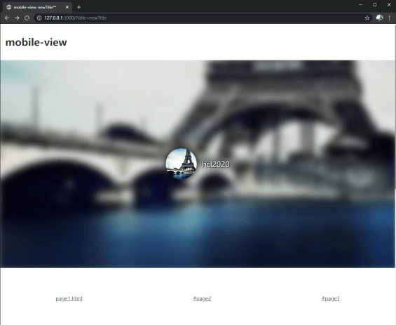
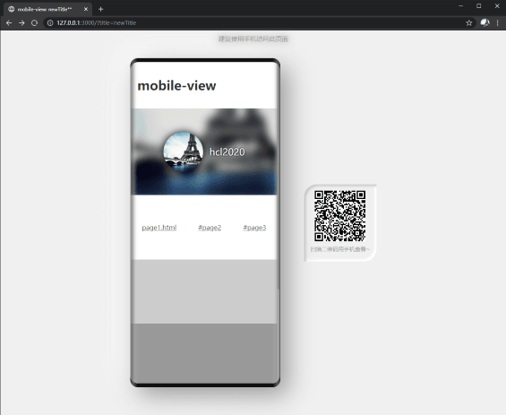

<p>
  <h1 align="center">MobileView</h1>
</p>

<p align="center">
  <a href="https://snyk.io/test/github/hcl2020/mobile-view?targetFile=package.json"></a>
  <a href="https://codecov.io/gh/hcl2020/mobile-view"></a>
  <a href="https://npmcharts.com/compare/mobile-view?minimal=true"></a>
  <a href="https://www.npmjs.com/package/mobile-view"></a>
  <a href="https://www.npmjs.com/package/mobile-view"></a>
</p>

**仅需两行代码，快速实现移动端网页在桌面端的预览适配**

提供与当前网址保持同步的二维码，支持单页和多页应用。

Use MobileView to quickly adapt the vertical web page of mobile to the horizontal display of large screen. Provide a QRCode of the current web address.
Support SPA and MPA.

## 演示 Demo

<a href="https://unpkg.com/mobile-view/example/index.html">在线演示 Online Demo</a>

### 使用前 Before

 <!--  -->
 

### 使用后 After

 <!--  -->
 

## 安装 Install

npm install mobile-view --save

## 使用 Usage

尽可能将以下代码放在所有代码之前。

Place the following codes before all codes whenever possible.

```html
<script src="https://unpkg.com/mobile-view"></script>
<script>
  MobileView();
</script>
```

```typescript
import MobileView from 'mobile-view';
MobileView();
```

### 配置示例 Options Example

```typescript
MobileView({
  message: '建议使用手机访问此页面, 或访问此页面的<a href="#">电脑版</a>',
  tips: '扫描二维码用手机查看~',
  threshold: 800
});
```

## 注意事项

MobileView 仅提供视图和路由相关功能，未进行移动端 touch 事件兼容处理。

如果你需要兼容移动端 touch 事件，可以使用 [@vant/touch-emulator](https://www.npmjs.com/package/@vant/touch-emulator) 这个库将 mouse 事件模拟成对应的 touch 事件。

## License

MIT © [HeChanglin](https://github.com/hcl2020)
